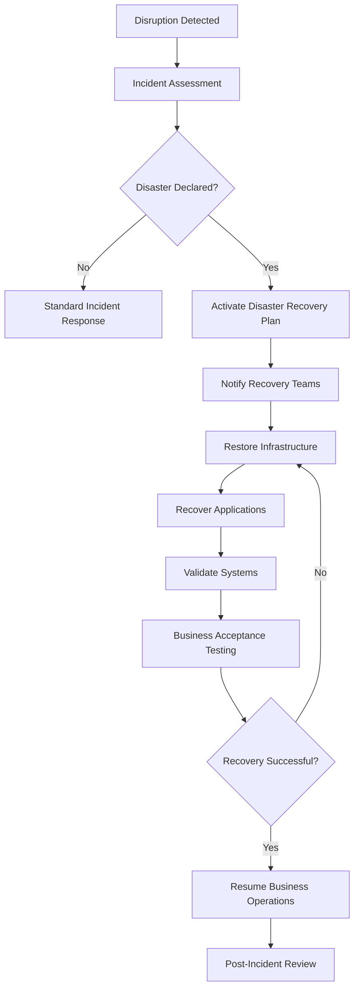

# Disaster Recovery Plan

## Executive Overview

This Disaster Recovery (DR) Plan demonstrates a structured approach to restoring critical technology services following a major disruption. It outlines recovery objectives, roles and responsibilities, recovery priorities, communication procedures, and post-recovery validation activities.

> **Portfolio Note:** This document is an original example created for professional portfolio purposes. It demonstrates disaster recovery planning concepts and does not contain confidential or proprietary information from any employer.

---

# Purpose

The purpose of this Disaster Recovery Plan is to establish a repeatable framework for recovering critical technology services while minimizing operational disruption and supporting business continuity objectives.

---

# Recovery Objectives

| Objective                      |     Target |
| ------------------------------ | ---------: |
| Recovery Time Objective (RTO)  |    4 Hours |
| Recovery Point Objective (RPO) | 15 Minutes |
| Maximum Acceptable Outage      |   24 Hours |

---

# Recovery Priorities

## Priority 1 – Critical Services

* Payment Processing Platforms
* Authentication Services
* Customer Online Banking
* Core Database Services
* Network Connectivity

## Priority 2 – High Priority Services

* Reporting Platforms
* File Transfer Services
* Operational Support Applications

## Priority 3 – Business Support Services

* Internal Collaboration Tools
* Knowledge Management Systems
* Training Platforms

---

# Recovery Roles & Responsibilities

| Role                     | Responsibilities                                            |
| ------------------------ | ----------------------------------------------------------- |
| Executive Sponsor        | Authorize disaster declaration and executive communications |
| Incident Manager         | Coordinate overall recovery activities                      |
| Technology Recovery Lead | Restore infrastructure and applications                     |
| Business Continuity Lead | Coordinate business operations and stakeholder updates      |
| Communications Lead      | Manage internal and external communications                 |
| Application Owners       | Validate application functionality after recovery           |

---

# Disaster Recovery Process

---

# Recovery Validation Checklist

* Infrastructure restored
* Applications operational
* Network connectivity verified
* Authentication services validated
* Customer-facing services tested
* Payment processing verified
* Monitoring systems operational
* Business owners approve production readiness

---

# Communication Plan

## Internal Stakeholders

* Executive Leadership
* Technology Teams
* Business Operations
* Information Security
* Risk Management

## External Stakeholders

* Customers (when applicable)
* Vendors
* Regulatory Authorities (when required)

---

# Success Measures

* Recovery completed within established RTO
* Data restored within RPO targets
* Critical services available to customers
* Business operations resumed successfully
* Post-recovery validation completed
* Lessons learned documented

---

# Skills Demonstrated

* Disaster Recovery Planning
* Technology Resiliency
* Business Continuity
* Incident Management
* Executive Communication
* Operational Readiness
* Risk Management
* Recovery Governance

